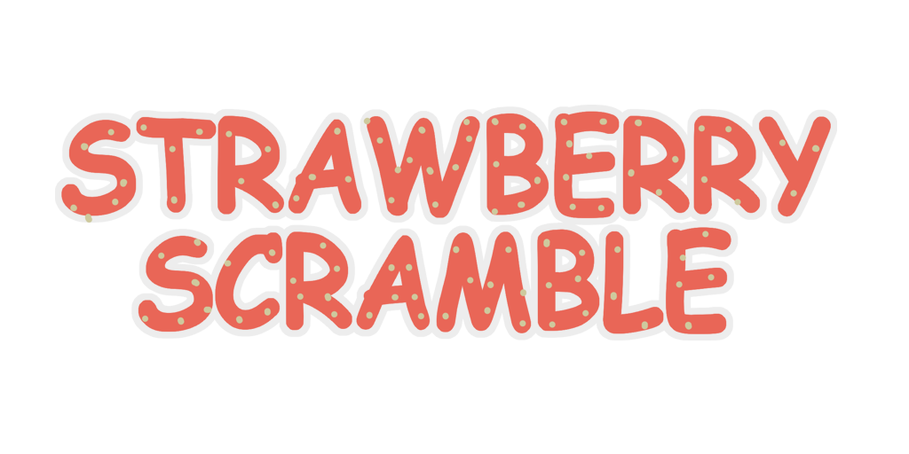

  

# Strawberry Scramble
Repositório de desenvolvimento do jogo Strawberry Scramble.

## Requisitos de Desenvolvimento
- [Godot 3.5.x](https://godotengine.org/download)
- [Git](https://git-scm.com/downloads)
- [GitHub Desktop](https://desktop.github.com/) (Opcional)

## Créditos
- Diego Almeida (arte)
- Erik Silva Ferreira (game design)
- Joel Gomes da Silva (programação, áudio)
- Luciano Abreu (arte)
